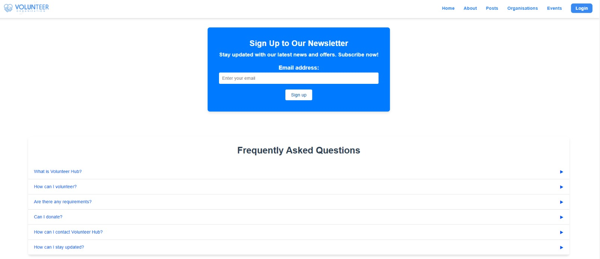
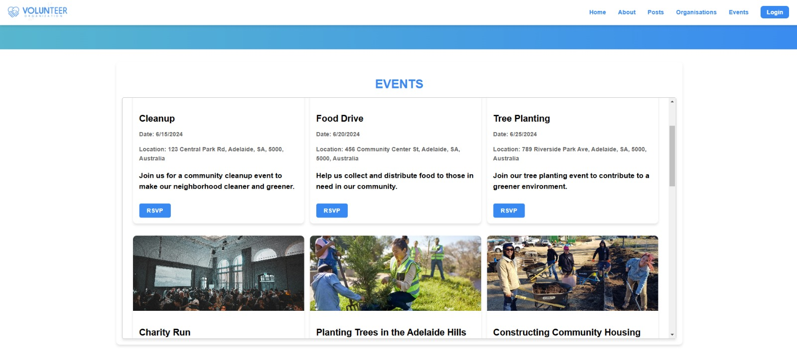
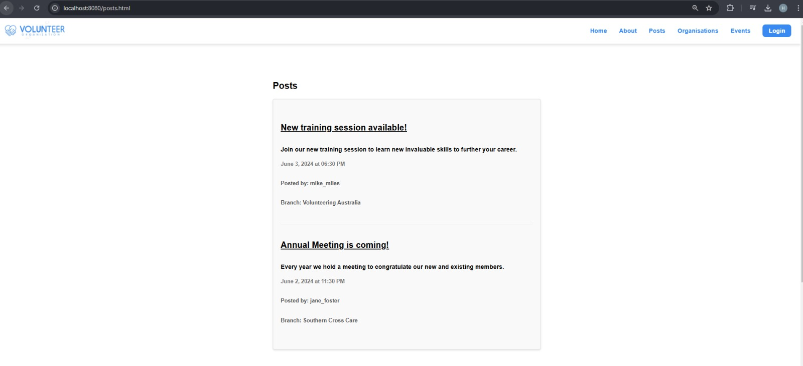
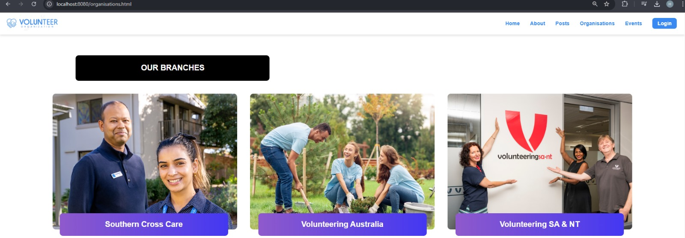
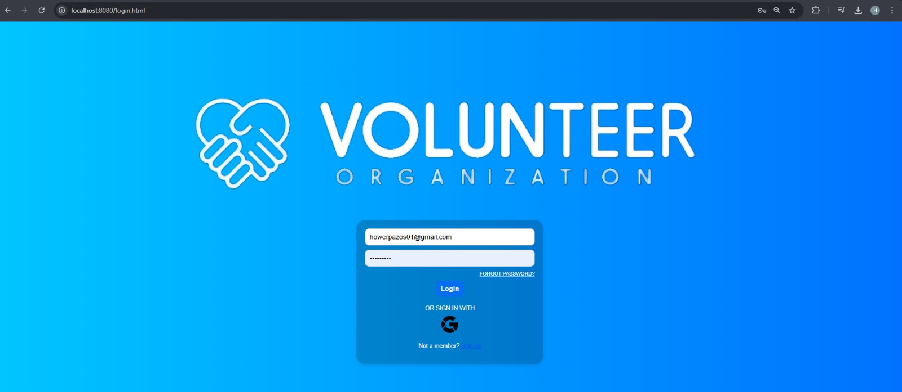
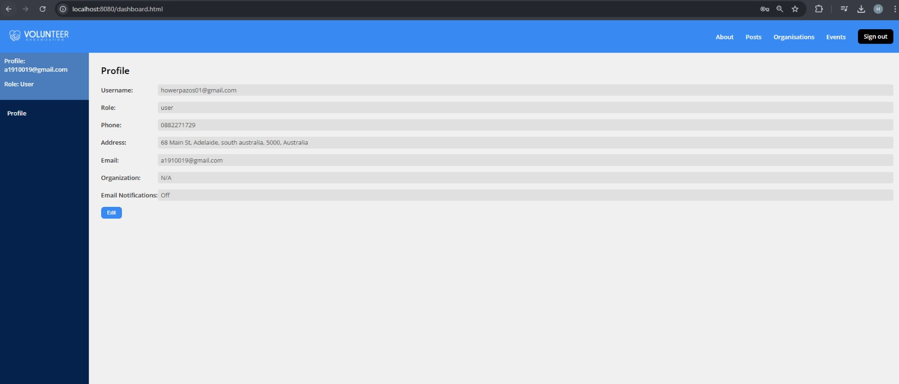
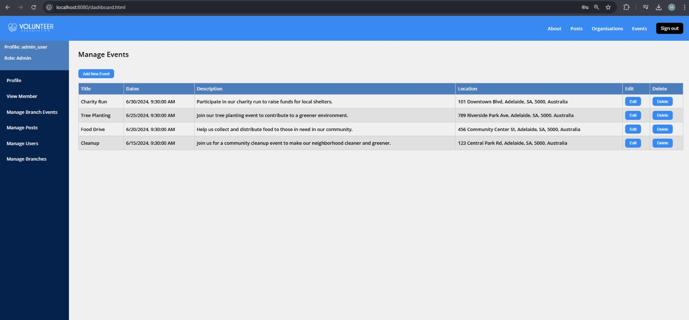

# Volunteer Organisation Web App

A full-stack web application built with Node.js and Express.js that connects volunteers with organizations and manages volunteer activities. The platform facilitates event organization, volunteer recruitment, and community engagement through a user-friendly interface.


## Overview

The Volunteer Organisation Web App is a comprehensive platform developed to bridge the gap between volunteers and organizations. Built with modern JavaScript frameworks, it provides a seamless experience for both volunteers and organizations to connect, organize events, and manage volunteer activities.

## Features

### User Management
- Role-based authentication system (Admin, Organization, Volunteer)
- Google authentication integration using Passport.js
- Secure user profiles with customizable settings
- Email notifications system for updates and event reminders

### Event Management
- Create and manage volunteer events
- Interactive event calendar
- RSVP functionality for volunteers
- Different event categories (Cleanup, Food Drive, Tree Planting, etc.)
- Location-based event searching

### Organization Features
- Organization profiles and branches management
- Event posting and volunteer coordination
- Communication tools with volunteers
- Activity tracking and reporting

### Communication
- Newsletter subscription system
- Real-time email updates through EmailJS
- Post creation and management

### Admin Dashboard
- Comprehensive event management interface
- User management system
- Content moderation tools
- Analytics and reporting features

## Technical Stack

### Frontend
- Vue.js (for certain dynamic UI elements)
- HTML5
- CSS3
- jQuery

### Backend
- Node.js
- MySQL database
- RESTful API architecture
- Express.js
- Passport & Google OAuth2.0 (authentication)
- Nodemailer (email service)
- bcrypt & bcryptjs (password hashing)
- Cookie-parser
- express-session (session management)
- morgan (HTTP request logging)

### Development & Deployment
- Docker (containerization)
- npm (package management)

### Dependencies
```json
{
  "dependencies": {
    "bcrypt": "^5.1.1",
    "bcryptjs": "^2.4.3",
    "cookie-parser": "~1.4.4",
    "debug": "~2.6.9",
    "dotenv": "^16.4.5",
    "express": "^4.19.2",
    "express-session": "^1.18.0",
    "morgan": "~1.9.1",
    "mysql": "^2.18.1",
    "mysql2": "^3.10.0",
    "nodemailer": "^6.10.0",
    "passport": "^0.7.0",
    "passport-google-oauth20": "^2.0.0"
  }
}
```

## Installation & Setup

### Prerequisites
- Docker
- Node.js
- MySQL
- Git

### Setup Instructions

1. Clone the repository
```bash
git clone https://github.com/hower-pazos/Volunteer-Organisation-Web-App.git
```

2. Start Docker container
```bash
# Open the Docker container
docker compose up -d
```

3. Install dependencies
```bash
# Install all required packages
npm install
```

4. Database Setup (in a new terminal)
```bash
# Start MySQL service
sudo service mysql start

# Import database schema
mysql < project_database.sql
```

5. Start Services (in separate terminals)

Terminal 1 - Email Service:
```bash
node emails.js
```

Terminal 2 - Main Application:
```bash
npm start
```

The application should now be running and accessible at `http://localhost:8080`

## Screenshots

### User Interface

*Newsletter signup and FAQ section for new visitors*


*Overview of upcoming volunteer events with details and RSVP options*

### Organization Features

*News and updates from various volunteering organizations*


*Different branches and their locations across Australia*

### User Management

*Secure login page with Google authentication option*


*User profile management interface*

### Administrative Features

*Administrative dashboard for managing volunteer events*

